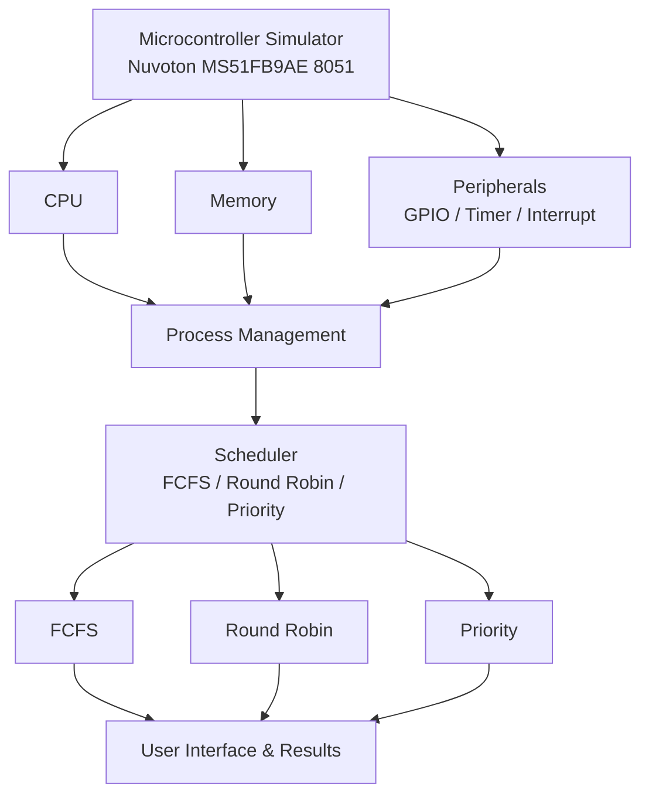

# Nuvoton-microcontroller-simulator
Nuvoton MS51FB9AE microcontroller simulator

## Project title: Educational Microcontroller Simulator with process

## Problem Objective:
To develop a simplified educational microcontroller simulator that demonstrates instruction execution,memory and peripheral operations and process management.The project integrates microprocessor architecture,data structure and operating systems concepts into single working systems.The simulator helps user to visualixe how programs are executes and how CPU manages multiple program.

## Problem Statement: 
Design and implement a software based simulator for the Nuvoton MS51FB9AE 8-bit microcontroller.The simulator will model basic processor components,instruction execution,memory,stack,GPIO,timer and interupts.It will also support multiple processes using PCB,ready queue,context texting and FCFS

## Project scope:
Simulate the basic components of the Nuvoton MS51FB9AE microcontroller.
Implement selected instructions, memory, stack, GPIO, timer, and interrupts.
Manage multiple programs as processes using PCB and ready queue.
Implement FCFS, Round Robin, and Priority scheduling with context switching.
Provide program loading, run, reset, and single-step execution.
Analyze waiting time, turnaround time, response time, context switches, and CPU utilization.

## Microcontroller being simulated:
Nuvoton MS51FB9AE a 8 bit 8051-based microcontroller,this simulator will model the essential architectural features required for the project.

## Team Members

Team Leader: Muhammed Nilamuddeen — 25190131.
J Subraya Shenoy — 25190117.
Saakshi — 25190143.
Manasi Maxin— 25190157.

## Team responsibilities:
RESPONSIBILITIES
Muhammed Nilamuddeen                  
Primary:OS scheduling and context switching
Secondary:Integration and github
                                       
Saakshi                                
Primary:Memory and stack
Secondary: Testing
                                       
J Subraya shenoy                       
Primary: CPU & Instruction execution
Secondary:UI and integration,Meetings
                                       
Mansi maxin                            
Primary:Data structures  and process management
Secondary:CPU support 

## Selected programming language: Java

## Initial System Architecture

## Initial development plan:

### Week 1 – Understanding the Microcontroller

* Learn the basic architecture of MS51FB9AE.
* Understand CPU, registers, PC, SP and flags.
* Study memory, stack, GPIO, timer and interrupts.
* Prepare the initial system architecture.
* Selecting the programming language as JAVA. 

 
